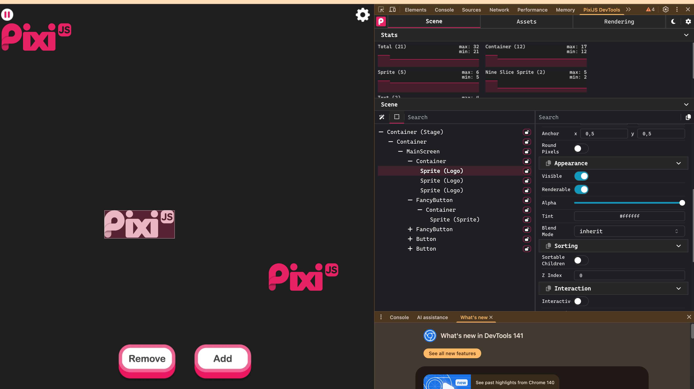

# devtools for pixi.js

Es una herramietas diseñada por pixi.js para poder manipilar elementos cuando la aplicacion ya se esta ejecutando

## Instalacion

- ir a [devtools Installation](https://pixijs.io/devtools/docs/guide/installation/)
- Instalar `plugin de Google Chrome` (recomendado porque esta probado pero se podria instalar la aplicacion)
- Requiere una configuracin de codigo
- Inslatar dependencia con `npm i`
- Listo!

## Uso

- Una vez instalado con la version de `plugin de Google Chrome`, tiene que ir a `impecionar` e ir a la pestaña `PixiJS DevTools`
- Ahí podrás ver todos los elementos asociados a `pixi.js`, si jerarquía he incluso intervenir en ellos

